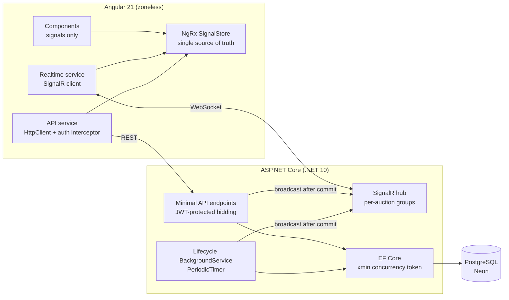

# LiveBid — Real-Time Auction Platform

A full-stack real-time auction platform where concurrent bidding, optimistic
concurrency control, and server-pushed state are the core of the design —
not afterthoughts.

**Stack:** Angular 21 (zoneless, signals, NgRx SignalStore) · ASP.NET Core
(.NET 10 minimal APIs) · SignalR · EF Core · PostgreSQL (Neon) · JWT auth

## Why this project

Most CRUD portfolio apps never face the hard questions: what happens when two
users act on the same row at the same instant? How does the UI stay truthful
when state changes server-side? LiveBid is built around exactly those
questions.

## Architecture



## Headline features

- **Optimistic concurrency on bids** — Postgres's `xmin` system column as an
  EF Core concurrency token. Simultaneous bids race; the loser gets a
  `DbUpdateConcurrencyException`, retries against fresh state, and re-validates.
  No locks held, no lost updates, every client gets a truthful answer.
  Verified with a parallel stress test (5 simultaneous bids → 1 winner,
  4 honest rejections).
- **Optimistic UI with rollback** — bids render instantly as pending, then
  reconcile on confirmation or roll back with the server's error. Dedup by
  bid ID handles the HTTP-response-vs-SignalR-broadcast race.
- **Server-authoritative lifecycle** — a `BackgroundService` transitions
  auctions Scheduled → Live → Ended and broadcasts changes; the client
  countdown is UX, never authority.
- **Zoneless Angular** — no zone.js; signals drive change detection
  end-to-end. State flows one way: REST + SignalR → SignalStore → components.
- **JWT auth done properly** — BCrypt password hashing, user-enumeration-safe
  login, bidder identity from the token's `sub` claim (never the request
  body), functional interceptor + guard with returnUrl.

## Running locally

Prereqs: .NET 10 SDK, Node 20+, a PostgreSQL database (free Neon tier works).

```bash
# Backend — from backend/LiveBid.Api
dotnet user-secrets init
dotnet user-secrets set "ConnectionStrings:LiveBid" "<your-postgres-connection-string>"
dotnet user-secrets set "Jwt:Key" "<any-long-random-string>"
dotnet ef database update
dotnet run          # API on http://localhost:5150

# Frontend — from frontend/
npm install
ng serve            # app on http://localhost:4200
```

Seed users: `alice` / `bob`, password `password123`.

## What I'd build next

- Refresh tokens + httpOnly cookie storage (current localStorage JWT is a
  deliberate, documented trade-off)
- Proxy bidding (max-bid with automatic increments)
- Authenticated SignalR hub connections
- Postgres LISTEN/NOTIFY or an outbox table to close the small
  commit-to-broadcast gap
- Horizontal scale-out with a SignalR backplane (Redis)
